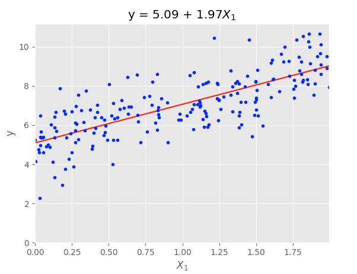

## Linear Regression

This folder contains source code for a from-scratch OOP implementation of linear regression and a wrapper for sklearn's linear regression, taken from HOML Chapter 4 Training Models.

The key idea of linear regression is to estimate the parameters of a linear function of input features (weighted sum plus a constant bias term) by minimising the Root Mean Square Error cost function (RMSE) on the training set. Using the Normal Equation, we can obtain a closed-form solution which yields parameters directly which minimise the cost function. Using these estimated parameters we can now compute predictions for items in the test set.

For example, the following plot shows the true values and estimated line equation for a model with a true equation of y = 5 + 2x + Gaussian noise:

<p align="center">
  
</p>

### Usage
```
# For custom implementation
python3 custom.py

# For library implementation
python3 library.py
```
